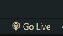
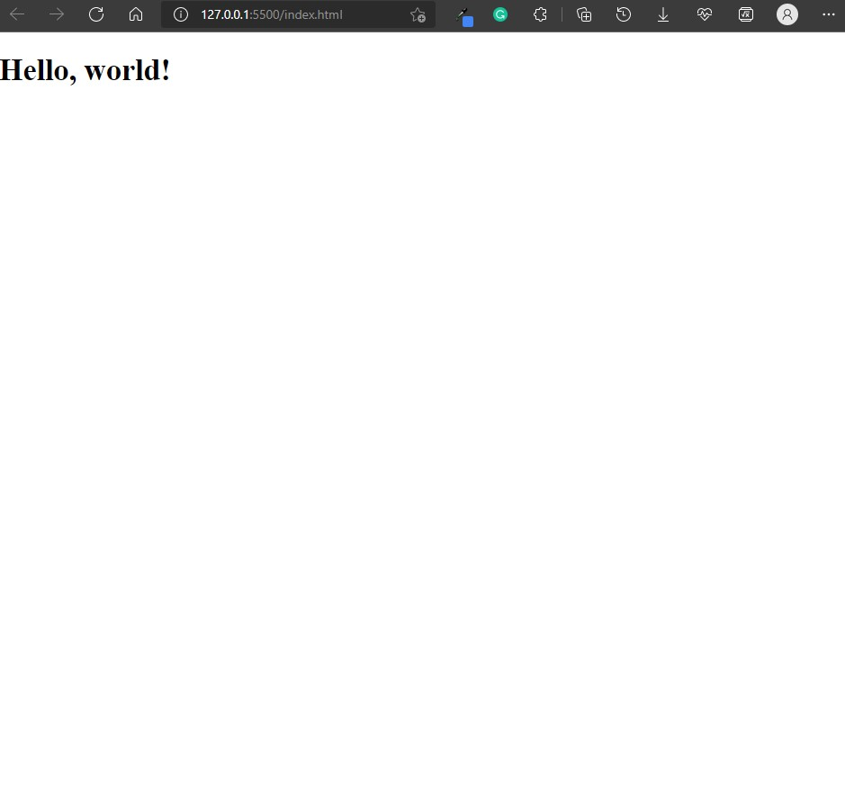

# Intersection observer experiment

This is my repository to experiment with intersection observer

## How to get started:
### **_Visual studio code_**
  1. download the [live server](https://marketplace.visualstudio.com/items?itemName=ritwickdey.LiveServer) from visual studio code extentions
  2. click the **"go live"** button from the bottom right of the vscode window
  
  3. After clicking it, it will open up your browser window and point to [localhost](localhost:5000):5000. From there, start coding 😁
  
  